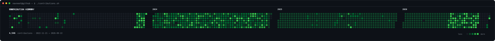
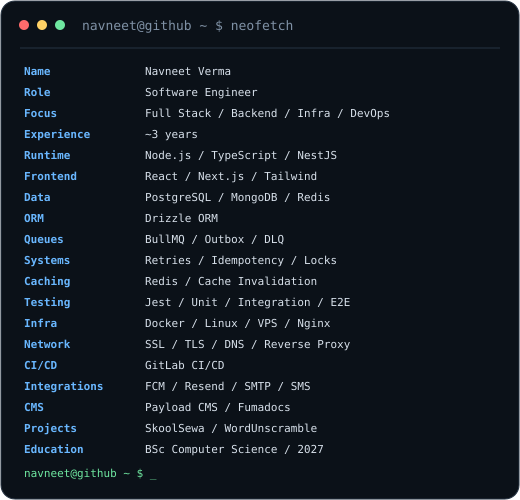

# NAVNEET VERMA

### Software Engineer

`Full Stack` · `Backend` · `Infrastructure` · `DevOps`

 

<a href="https://www.linkedin.com/in/navneet-verma-987bb9257/">LinkedIn</a>
&nbsp;&nbsp;·&nbsp;&nbsp;
<a href="https://github.com/Navn-eet">GitHub</a>
&nbsp;&nbsp;·&nbsp;&nbsp;
<a href="mailto:vnavneet631@gmail.com">Email</a>

 

---

 

<h3><code>navneet@github ~ $ ./contributions.sh</code></h3>

 

---

 

<h3><code>navneet@github ~ $ whoami</code></h3>

<table>
<tr>

<td width="45%" valign="top">

</td>

<td width="55%" valign="top">

</td>

</tr>
</table>

 

---

## `navneet@github ~ $ cat toolbox`

### BUILD

`TypeScript` · `JavaScript` · `Node.js` · `NestJS`  
`React` · `Next.js` · `REST APIs` · `Webhooks`

 

### DATA

`PostgreSQL` · `MongoDB` · `Redis` · `Drizzle ORM`  
`Database Modeling` · `Query Optimization` · `SQL`

 

### DISTRIBUTED SYSTEMS

`BullMQ` · `Transactional Outbox` · `Dead Letter Queues`  
`Event-Driven Systems` · `Background Jobs` · `Retries`  
`Idempotency` · `Backpressure` · `Distributed Locks`

 

### INFRASTRUCTURE

`Docker` · `Docker Compose` · `Linux` · `VPS`  
`Nginx` · `SSL/TLS` · `DNS` · `Reverse Proxy`

 

### CI/CD & TESTING

`GitLab CI/CD` · `Jest` · `Unit Testing`  
`Integration Testing` · `End-to-End Testing` · `Database Testing`

 

### INTEGRATIONS

`S3-Compatible Storage` · `Firebase FCM` · `Resend`  
`SMTP` · `SMS Gateways` · `Third-Party APIs`

 

---

## `navneet@github ~ $ ls ./work`

### SkoolSewa

School management platform covering administration, academics,
attendance, communication, assignments, examinations, student management,
and supporting infrastructure.

`TypeScript` · `Node.js` · `NestJS` · `PostgreSQL` · `Redis` · `BullMQ` · `Docker`

 

### WordUnscramble.ai

Web application focused on word discovery and search workflows.

`TypeScript` · `Next.js` · `Node.js` · `PostgreSQL`

 

### CRM & Content Management Platform

Full-stack platform covering application workflows, backend services,
content management, integrations, and deployment.

`TypeScript` · `Next.js` · `Node.js` · `Payload CMS` · `PostgreSQL`

 

### Shopit Nepal

E-commerce application with product, customer, and backend application
workflows.

`Node.js` · `TypeScript` · `PostgreSQL` · `Redis`

 

---

## `navneet@github ~ $ cat experience`

**Full Stack Engineer — Nomor LLC / Protozoa Host**

Kathmandu, Nepal · Jun 2025 — Present

Working across full-stack applications, backend services, databases,
integrations, infrastructure, deployments, debugging, and production
maintenance.

- Backend APIs and application architecture
- PostgreSQL, MongoDB, Redis and database design
- Background processing with BullMQ
- Transactional outbox and dead-letter queue patterns
- Authentication and third-party integrations
- Docker-based deployments
- Linux, VPS, Nginx, SSL and DNS configuration
- GitLab CI/CD
- Testing and production debugging
- Working within and extending existing codebases

 

---

## `navneet@github ~ $ cat education`

**BSc (Hons) Computer Science**

Herald College Kathmandu · University of Wolverhampton

Expected 2027

 

---

## `navneet@github ~ $ ./cv`

<a href="./assets/Navneet-Verma-CV.pdf">

**[ DOWNLOAD CV ]**

</a>

 

---

`navneet@github ~ $ exit`

  

<a href="https://github.com/Navn-eet">github.com/Navn-eet</a>
&nbsp;&nbsp;·&nbsp;&nbsp;
<a href="https://www.linkedin.com/in/navneet-verma-987bb9257/">LinkedIn</a>
&nbsp;&nbsp;·&nbsp;&nbsp;
<a href="mailto:vnavneet631@gmail.com">Email</a>

  

Software Engineer · Backend · Infrastructure · DevOps

