# Navneet Verma

### Software Engineer

Full Stack · Backend · Infrastructure · DevOps

 

<a href="https://www.linkedin.com/in/navneet-verma-987bb9257/">LinkedIn</a>
&nbsp;&nbsp;·&nbsp;&nbsp;
<a href="https://github.com/Navn-eet">GitHub</a>
&nbsp;&nbsp;·&nbsp;&nbsp;
<a href="mailto:vnavneet631@gmail.com">Email</a>

 

## About

I'm a Computer Science student and Software Engineer with around 3 years of experience building, testing, deploying, and maintaining full-stack web applications and backend systems.

My strongest focus is backend engineering, databases, distributed systems, infrastructure, and DevOps. I also work across the frontend when building complete products, taking systems from application interfaces and APIs through background processing, deployment, debugging, and production maintenance.

I enjoy working on systems where application architecture, data integrity, reliability, and operational concerns come together.

 

## Engineering

<table>
<tr>
<td width="50%" valign="top">

### Backend

TypeScript  
Node.js  
NestJS  
REST APIs  
Webhooks  
Background Processing  
Distributed Systems

</td>
<td width="50%" valign="top">

### Data

PostgreSQL  
MongoDB  
Redis  
Drizzle ORM  
Database Design  
Query Optimization  
Caching

</td>
</tr>

<tr>
<td width="50%" valign="top">

### Infrastructure

Docker  
Docker Compose  
Linux  
VPS  
Nginx  
SSL/TLS  
DNS  
Reverse Proxy

</td>
<td width="50%" valign="top">

### Reliability

BullMQ  
Transactional Outbox  
Dead Letter Queues  
Retries  
Idempotency  
Distributed Locks  
Backpressure

</td>
</tr>

<tr>
<td width="50%" valign="top">

### Frontend

React  
Next.js  
HTML  
CSS  
Tailwind CSS

</td>
<td width="50%" valign="top">

### Testing & APIs

Jest  
Unit Testing  
Integration Testing  
End-to-End Testing  
Database Testing  
Swagger / OpenAPI

</td>
</tr>
</table>

 

## GitHub Activity

 

 

## Focus

<table>
<tr>
<td align="center" width="25%">

**Backend**

APIs  
Services  
Architecture  
Integrations

</td>
<td align="center" width="25%">

**Data**

PostgreSQL  
Redis  
MongoDB  
Data Integrity

</td>
<td align="center" width="25%">

**Systems**

Queues  
Workers  
Caching  
Distributed Processing

</td>
<td align="center" width="25%">

**Infrastructure**

Docker  
Linux  
Nginx  
CI/CD

</td>
</tr>
</table>

 

## Education

**BSc (Hons) Computer Science**  
Herald College Kathmandu — University of Wolverhampton  
Expected 2027

 

---

Building reliable software from application code to production infrastructure.

